# Architecture

How the pipeline works, stage by stage: the data flow, the exact algorithms behind each script, and the full fine-tuning recipe.

## Pipeline overview

Eight independent scripts form a linear pipeline. Each stage reads only files written by earlier stages, so any stage can be re-run in isolation.

```mermaid
flowchart LR
    CSV[yelp_reviews.csv<br/>229,907 reviews] --> P[01_prepare_data.py]
    P --> TI[data/train_interactions.parquet<br/>104,242 rows]
    P --> TE[data/test_items.parquet<br/>1,988 rows]
    P --> UH[data/user_histories.json]
    P --> GT[data/genrec_train.jsonl<br/>30,000 examples]
    TI --> CB[02_classic_baselines.py]
    CB --> RC[results/recs_&lt;model&gt;.jsonl ×5]
    TI --> RB[06_recommenders_baselines.py<br/>SAR + BPR]
    RB --> RC2[results/recs_sar / recs_bpr]
    RC2 --> EV
    TI --> DF[07_neural_ctr_baselines.py<br/>DeepFM + Wide &amp; Deep]
    DF --> RC3[results/recs_deepfm / recs_widedeep]
    RC3 --> EV
    TI --> PS[08_pinsage.py<br/>GCN on the user/business graph]
    CSV --> PS
    PS --> RC4[results/recs_pinsage &#40;+ 4 ablations&#41;]
    RC4 --> EV
    GT --> TR[03_genrec_train.py<br/>QLoRA fine-tune]
    TR --> AD[models/genrec_lora/<br/>LoRA adapter]
    AD --> IN[04_genrec_infer.py<br/>10-beam generation]
    UH --> IN
    IN --> RG[results/recs_genrec.jsonl]
    RC --> EV[05_evaluate.py]
    RG --> EV
    TE --> EV
    EV --> FM[results/final_metrics.json]
```



Five model families consume the **same training interactions** and are scored on the **same held-out items**:

- the five classic recommenders (Stage 2) operate on the `(user, item, rating)` matrix;
- SAR and BPR (Stage 6, from the recommenders-team library) operate on the same interactions with ranking objectives;
- DeepFM and Wide & Deep (Stage 7) treat each interaction as a multi-field categorical example and learn feature interactions with a neural net;
- PinSage (Stage 8, arXiv 1806.01973) treats them as a bipartite **graph** and learns item embeddings from content features plus graph position — the only model here with no item-ID parameters at all;
- GenRec operates on the *textual sequence of business names*, per the paper (arXiv 2307.00457): recommendation as conditional text generation.

---

## Stage 1 — Data preparation (`01_prepare_data.py`)

**Input:** `yelp_reviews.csv`, columns `user_id, business_id, business_name, stars, date`.

**Cohort.** Users with ≥ 20 reviews (`MIN_REVIEWS = 20`) → 1,988 users, 106,230 interactions over 10,230 businesses. This keeps every test user with a meaningful history while staying small enough for a ~2-hour end-to-end run; the constant is the single knob for scaling up (≥ 10 gives 4,393 users / 138k interactions).

**Name handling.** Two normalizations with different jobs:

- *Display form* (used in prompts): raw name with whitespace collapsed — `"Joe's  Real BBQ" → "Joe's Real BBQ"`. Casing is preserved because the LLM learns to generate it.
- *Match form* (`norm_name`, used everywhere hits are decided): display form lowercased. All eight models are scored in this space.

**Chronological ordering.** A single stable sort by `date` over the whole frame (`sort_values(kind="stable")`). Yelp dates have day granularity, so same-day reviews by one user keep their original CSV order — deterministic across runs.

**Leave-one-out split** (the paper's protocol). `groupby(user).tail(1)` after the sort selects each user's chronologically last review → `test_items` (1,988 rows). Everything else → `train_interactions` (104,242 rows). An assertion checks the two partitions sum to the input exactly.

**GenRec training examples.** For each user's *training* sequence `s₁ … sₙ` (test item excluded by construction), a sliding window emits one example per position `i ≥ MIN_CONTEXT (3)`:

- input: the up-to-15 names before position `i` (`MAX_HISTORY = 15`, bounds the prompt to ~320 tokens),
- output: the name at position `i`.

This yields 98,278 candidate examples; a seeded `random.sample` keeps 30,000 (`N_TRAIN_EXAMPLES`). Each JSONL row carries `instruction / input / output`:

```json
{"instruction": "Given a list of restaurants the user has visited in chronological order, predict the restaurant the user will visit next.",
 "input": "Restaurants visited: Four Peaks Brewing Co, Heart Attack Grill, ...",
 "output": "Joe's Real BBQ"}
```

A leakage assertion verifies no example's target equals the user's held-out test name unless that name also legitimately occurs inside the training sequence (chains can repeat).

---

## Stage 2 — Classic baselines (`02_classic_baselines.py`)

All five models train on `train_interactions` only, expressed as a dense matrix pair:

- `R` — ratings, `float32`, shape `1988 × 10165` (items that appear in training),
- `B = (R > 0)` — the observation mask,
- `μ` — global mean rating (the fallback prediction).

Dense is deliberate: at this scale `R` is 81 MB and every similarity computation becomes one or two BLAS matmuls.

### Similarities (surprise semantics, vectorized)

`scikit-surprise` computes similarities **over co-rated entries only**, which differs from naive matrix cosine. Both are reproduced exactly with mask algebra — zero entries contribute nothing to the numerators, and the masks restrict the norms:

- **Cosine** (user-user): `num = R·Rᵀ`; `d₁ = (R∘R)·Bᵀ` gives, for each pair `(a,b)`, `Σ r_a²` *over items b also rated*. Then `sim = num / √d₁ ∘ √d₁ᵀ`.
- **MSD** (item-item): with `S = R·Rᵀ`, `Q = (R∘R)·Bᵀ`, `C = B·Bᵀ` (co-rating counts), the summed squared difference is `D = Q + Qᵀ − 2S` and surprise's `sim = 1/(msd+1)` becomes `C/(D+C)`.

### KNNBasic prediction, full catalog

surprise predicts `r̂(u,i) = Σ_{v∈topk} sim·r / Σ_{v∈topk} sim` over the k most similar neighbors *who rated i*, falling back to `μ` when fewer than `min_k` positive-similarity neighbors exist. Naively that is a per-`(u,i)` top-k over 20M pairs. Two observations make it fast:

1. **All ratings are positive, so all sims are ≥ 0** — "top-k by similarity, then keep sim > 0" equals surprise's `nlargest(k)` + positive-sim accumulation.
2. **Most items have fewer raters than k** (mean ≈ 10 raters vs k = 40), so for them "top-k neighbors" = *all* raters, and the whole prediction matrix collapses to three matmuls: `num = Sim·R`, `den = Sim·B`, `cnt = (Sim>0)·B`.

Only the exceptions get corrected: the 562 items with > 40 raters (user-user) and the 1,138 users with > 30 rated items (item-item) are re-computed with an `argpartition`-based exact top-k over just their rater/rated slices. Predictions with `cnt < min_k` or zero denominator become `μ`. Hyperparameters are the tuned values: user-user cosine k=40/min_k=6, item-item msd k=30/min_k=9.

### FunkSVD

Plain SGD on `r̂ = μ + b_u + b_i + q_i·p_u`, 100 factors, `N(0, 0.1)` init with a fixed seed, and tuned `n_epochs=20, lr=0.01, reg=0.2`. The update uses pre-update copies of `p_u, q_i` (matching surprise's implementation ordering).

### From scores to recommendations

For every model: mask already-rated items to `−∞`, stable-argsort each user's row, walk down the ranking mapping `business_id → norm_name`, dedupe names keeping the best rank, stop at 10. Rank-based and popularity are the same machinery with a broadcast global score row (average rating with ≥ 50 interactions; rating count).

### Why trust a reimplementation

Two independent validations, both in the repo:

1. **Cross-implementation check** — the vectorized full-matrix KNN was compared against a separately written per-pair predictor on 500 random unseen pairs: max abs difference 1e-6.
2. **Rating-protocol sanity run** — the same code, run under a classic rating-prediction protocol (≥ 100-review cohort, seeded random 80/20 rating split, clipped predictions, precision/recall@10 at threshold 3.5), lands in the expected range for these algorithms on this data: RMSE 0.93–0.99, F1@10 0.50–0.57 (`results/sanity_check_rating_protocol.json`).

---

## Stage 3 — Fine-tuning (`03_genrec_train.py`)

The paper fine-tunes LLaMA-7B with LoRA on instruction-formatted sequences (lr 3e-4, max length 256, batch 128, AdamW, 4×A5000). This implementation adapts that recipe to consumer-GPU scale, parametrized via `--base / --epochs / --out`:

- **v1 (quick):** Llama-3.2-1B, 30k sampled windows, 2 epochs — 21 min, final loss ≈ 1.60.
- **v2 (scaled, current default):** Llama-3.2-3B, all 98,278 windows, 3 epochs (18,429 steps) — 4.3 h at 1.16 it/s, final loss ≈ 1.40.

The description below applies to both; numbers cite the v1 run where they differ only by scale.

### Model loading

```python
FastLanguageModel.from_pretrained("unsloth/Llama-3.2-1B-Instruct",
                                  max_seq_length=320, load_in_4bit=True)
```

unsloth resolves this to the pre-quantized `llama-3.2-1b-instruct-unsloth-bnb-4bit` checkpoint (NF4 weights, bf16 compute). `max_seq_length=320` covers the longest prompt (15 names ≈ 200–280 tokens with the chat template) with headroom.

### LoRA configuration

| Setting | Value | Note |
|---|---|---|
| Rank r | 16 | α = 32 (scale 2.0), dropout 0 |
| Target modules | `q,k,v,o,gate,up,down_proj` | all attention + MLP projections, every layer |
| Trainable params | 11,272,192 | 0.90% of 1.25B |
| Gradient checkpointing | `"unsloth"` | activation offload variant |
| Seed | 42 | |

The frozen base stays in 4-bit; only the LoRA matrices train in higher precision — QLoRA. Peak VRAM stays far under the card's 16 GB.

### Example formatting

Each JSONL row becomes a three-turn Llama-3.2 chat:

```
<|begin_of_text|><|start_header_id|>system<|end_header_id|>
You are a restaurant recommendation system.<|eot_id|><|start_header_id|>user<|end_header_id|>
Given a list of restaurants ... Restaurants visited: A, B, C, ...<|eot_id|><|start_header_id|>assistant<|end_header_id|>
Joe's Real BBQ<|eot_id|>
```

A fixed system prompt is supplied so the template is byte-identical between training and inference. (unsloth detects and removes the double BOS that `apply_chat_template` + the trainer's tokenization would otherwise produce.)

### Loss masking — the crucial detail

`train_on_responses_only(trainer, instruction_part="<|start_header_id|>user<|end_header_id|>\n\n", response_part="<|start_header_id|>assistant<|end_header_id|>\n\n")` sets `labels = -100` on everything except the assistant span. The script asserts this on a sample; the surviving tokens decode to exactly:

```
"Joe's Real BBQ<|eot_id|>"
```

So the model is optimized *only* on generating the next restaurant's name and stopping — the paper's "output" target — not on reproducing the prompt.

### Optimization

| Setting | Value | Rationale |
|---|---|---|
| Learning rate | 3e-4, linear decay | the paper's peak LR |
| Warmup | 100 steps | scaled-down version of the paper's 1,000 (we take ~4k steps, they took far more) |
| Batch | 8 per device × 2 grad-accum = 16 | fits comfortably; 30k examples → 1,875 steps/epoch |
| Epochs | 2 (3,750 steps) | initial-metrics budget; paper used 5 |
| Optimizer | `adamw_8bit`, weight decay 0.01 | |
| Precision | bf16 compute over NF4 weights | |
| Packing | off; unsloth auto-enables padding-free batching | same effect as packing without cross-example attention |

### Training dynamics

Loss (on target names only) falls 4.45 → ~1.9 across epoch 1, drops sharply at the epoch boundary (1.88 → 1.72, the model re-seeing examples), and settles ≈ 1.60. Runtime: **1,284 s (21.4 min), 46.7 examples/s** on the RTX 5070 Ti. The full curve is plotted in `results/report.html`.

Post-training, the script saves the adapter (`models/genrec_lora/` — adapter weights + tokenizer, ~60 MB) and runs a 5-prompt greedy smoke test to confirm the model emits plausible catalog names.

---

## Stage 4 — Inference (`04_genrec_infer.py`)

**Why plain `transformers` + `peft` here, not unsloth:** unsloth's patched fast-generate returns the KV cache as a raw tuple; transformers 5.x beam search calls `past_key_values.reorder_cache(beam_idx)` when it permutes beams, and crashes (`AttributeError: 'tuple' object has no attribute 'reorder_cache'`). Loading the same 4-bit base with vanilla `AutoModelForCausalLM` and attaching the adapter with `PeftModel.from_pretrained` restores standard cache objects, and beam search works. Fine-tuning still gets unsloth's speed; only generation goes through the stock path.

**Prompt.** Identical system + instruction template, user's last ≤ 15 training-history names, `add_generation_prompt=True` so the text ends at the assistant header.

**Generation.** Users are batched with **left padding** (decoder-only requirement), then beam search via `model.generate(num_beams=N, num_return_sequences=N, do_sample=False, early_stopping=True, max_new_tokens=24)`. The output's prompt prefix is sliced off (valid because left padding aligns all prompts to the same length) and the N continuations per user are decoded.

**Constrained decoding (v2 default).** A token trie is built over all 7,218 catalog display names (each name tokenized once with `add_special_tokens=False`; terminal nodes admit `<|eot_id|>`). A `prefix_allowed_tokens_fn` walks the trie along the tokens generated so far and returns the legal continuations — every beam is thereby forced to spell a real business name and stop. `--exclude-seen` builds per-user tries omitting the user's visited names (~10 ms each from the pre-tokenized cache); measured effect: none — the model wasn't spending beams on revisits. `--unconstrained` restores v1's free-form decoding.

**Post-processing per user** — the generative analog of the classics' seen-item masking:

1. normalize each beam string (`norm_name`),
2. dedupe preserving beam order (beam order ≈ model confidence → list rank),
3. drop names already in the user's history (`recs`); the unfiltered list is kept as `recs_raw` for diagnostics.

Throughput: ~8.7 users/s, **3.8 min** for 1,988 users. Diagnostics computed at the end: 97.7% of raw generations exist in the catalog; 10.9% were already-visited and got filtered; deduped lists average 8.9 names.

---

## Stage 6 — recommenders-team baselines (`06_recommenders_baselines.py`)

Two ranking-optimized algorithms from the [recommenders-team library](https://github.com/recommenders-team/recommenders), run through the actual library rather than reimplemented. It supports Python ≤ 3.11 and (as of 1.2.1) NumPy < 2, so this stage runs in its own venv (`.venv-rec`, CPython 3.11 + `recommenders` + `numpy==1.26.4`) — the pipeline's file-based handoff makes mixing interpreters trivial.

- **SAR** (`recommenders.models.sar.SAR`): user affinity = time-decayed sum of ratings (30-day half-life on review timestamps); item similarity = Jaccard over co-occurrence; score = affinity × similarity. Top-30 via `recommend_k_items(remove_seen=True)`, then the shared name-dedupe → top-10. One duplicate (user, item) rating is collapsed keeping the most recent — matching the dense-matrix baselines' last-write-wins behavior.
- **BPR** (via Cornac, the backend the recommenders library wraps): implicit-feedback MF trained with a pairwise ranking loss — k=100 factors, 200 iterations, lr 0.01, reg 0.001, seed 42. Scores for all items come from the learned factors (`U·Vᵀ + b_i`) mapped back to this pipeline's index order, seen items masked.

Both emit `results/recs_{sar,bpr}.jsonl` in the shared format and flow through Stage 5 unchanged. They are the strongest baselines in the final table — evidence that *ranking-objective* models are the right classical comparison for top-N, not rating predictors.

## Stage 7 — Neural CTR baselines (`07_neural_ctr_baselines.py`)

Two deep architectures from the CTR-prediction literature, written directly in PyTorch, sharing all the data plumbing so the only thing that varies is the model. Their point in this benchmark is to separate *model capacity* from *training objective* — they are the only baselines with neural networks in them, and both still lose to shallow BPR.

### DeepFM (Guo et al., arXiv 1703.04247)

One embedding table `E ∈ ℝ^{V×d}` is shared by both components (that sharing is DeepFM's contribution over the earlier Wide & Deep):

```
first-order : w0 + Σ_j w_{x_j}                                  ← linear term, per-feature weight
second-order: ½ · ( ‖Σ_j v_j‖² − Σ_j ‖v_j‖² ) = Σ_{j<k} ⟨v_j,v_k⟩ ← all pairwise interactions in O(F·d)
deep        : MLP( [v_1; …; v_F] ), 128 → 64 → 1, ReLU           ← high-order interactions
logit       : first-order + second-order + deep
```

### Wide & Deep (Cheng et al., arXiv 1606.07792)

The architecture DeepFM was written to improve on. A sparse linear **wide** model provides memorization, a **deep** MLP provides generalization, and — unlike DeepFM — the two halves share no parameters:

```
wide  : b + Σ_j w_{x_j} + Σ_c w_{φ_c(x)}     ← raw fields + hand-built cross-products
deep  : MLP( [v_1; …; v_F] ), own embeddings ← 128 → 64 → 1, ReLU
logit : wide + deep                           (jointly trained)
```

The cross-products φ(x) are the wide part's whole memorization capacity, and choosing them is the manual work DeepFM exists to eliminate:

| Cross | Size | What it can memorize |
|---|---|---|
| `user_id × item_popularity_bucket` | 1,988 × 12 | this user's taste for popular vs obscure places |
| `user_id × item_avg_star_bucket` | 1,988 × 12 | this user's taste for highly- vs poorly-rated places |
| `user_activity × item_popularity` | 12 × 12 | do heavy users go to popular places? |
| `user_avg_star × item_avg_star` | 12 × 12 | do generous raters go to well-rated places? |

`user_id × item_id` is deliberately **excluded**: with one row per observed pair it is a lookup table over the training positives, contributing nothing at scoring time (every candidate pair is unseen by construction) while soaking up gradient that should reach the deep part.

Deviation from the paper: it trains the wide half with FTRL+L1 and the deep half with AdaGrad. PyTorch has no FTRL, so both halves use Adam — which also keeps the DeepFM comparison optimizer-neutral.

### Shared setup

**Feature fields (F = 6).** Every field is categorical and offset into the shared vocabulary so ids never collide:

| Field | Cardinality | Derivation |
|---|---|---|
| `user_id` | 1,988 | — |
| `user_activity_bucket` | ≤12 | `⌊log₂(#train interactions)⌋ + 1` |
| `user_avg_star_bucket` | ≤12 | mean training rating, half-star bins |
| `item_id` | 10,165 | — |
| `item_popularity_bucket` | ≤12 | `⌊log₂(#train interactions)⌋ + 1` |
| `item_avg_star_bucket` | ≤12 | mean training rating, half-star bins |

The bucketed fields are deterministic functions of the ids, so they add no new information — what they add is *sharing*: a rarely-visited restaurant borrows its popularity/quality embedding from every other rare restaurant, which is exactly the smoothing a long-tail catalog needs. They are recomputed from whichever interaction set the model is being fit on, so the validation phase never sees statistics derived from its own held-out items.

**Objective.** Implicit feedback with negative sampling: every observed `(user, item)` pair is a positive, and 16 items the user has not visited are drawn uniformly per positive (rejection-sampled against the seen matrix, redrawn every epoch), all with label 0. Binary cross-entropy, Adam (lr 1e-3, weight decay 1e-6), batch 8,192.

**Model selection without touching the test set.** Each user's last *training* interaction is held out as validation; the model trains on the rest and its validation HR@10 (same name-level dedupe as the real metric) is measured after every epoch, with early stopping (patience 8). `--sweep` grid-searches dim × negatives × dropout that way — 18 configs per architecture, and **both picked the same winner**: dim 16, 16 negatives, no dropout. Each final model is then refit on the *full* training data for its winning epoch count and scores all 1,988 × 10,165 pairs in chunks, seen items masked, name-deduped to top-10.

**Watch the noise floor.** At HR@10 ≈ 0.04 the validation metric is ~80 hits out of 1,988, and one hit is 0.0005. Taking the max over 60 epochs × 18 configs therefore selects partly on noise: the same code re-run under 6 seeds (full protocol each time, epochs re-selected) spans 0.0352–0.0397 for DeepFM and 0.0352–0.0387 for Wide & Deep. The one effect that survives this noise is the negative count — 16 > 8 > 4 at every dim for both models. Embedding size does nothing consistent. Treat single-run differences under ~10 hits between any two models here as unresolved.

**What it shows.** The two architectures finish second and third and are statistically tied with each other (6-seed mean HR@10 0.0375 vs 0.0370 — one hit apart), both ahead of SAR (0.0312) and popularity (0.0277), both behind BPR (6-seed mean 0.0459). Two lessons: DeepFM's FM component buys nothing over four hand-picked crosses when there are only 6 fields to cross, and neither deep model catches a shallow MF trained with a pairwise ranking loss. Architecture lost to objective.

## Stage 8 — PinSage (`08_pinsage.py`)

*Ying et al., KDD 2018, [arXiv 1806.01973](https://arxiv.org/abs/1806.01973) — "Graph Convolutional Neural Networks for Web-Scale Recommender Systems."*

The first **graph** model in the benchmark, and the only one that never learns a per-item parameter: PinSage is inductive, so a business is nothing but its content features plus its position in the user/business graph. It was built for a 3-billion-node pin/board graph at Pinterest, which makes some of its engineering redundant here and some of its modelling claims directly testable.

### The bipartite graph

| Pinterest | Yelp | count |
|---|---|---|
| pin (has features) | business | 10,165 |
| board (no features) | user | 1,988 |
| pin ∈ board | user reviewed business | 104,241 edges |

Random walks run **business → user → business**, so every neighbourhood `N(u)` is a set of businesses, and the paper's footnote 3 — only pins have features, so the layer count must be even — is satisfied by construction: each item-level convolution is two bipartite hops.

### Importance-based neighbourhoods (§3.2)

Classic GCNs convolve over the k-hop neighbourhood, whose size explodes with node degree. PinSage instead defines `N(u)` as the **top-T nodes by L1-normalized random-walk visit count** — which the paper's own footnote 2 notes approximate the Personalized PageRank scores w.r.t. `u` in the limit of infinite simulations.

`random_walk_neighborhoods` simulates that directly on the GPU: 256 source items at a time, `N_WALKS` chains each, `WALK_LEN` two-hop steps per chain, restart probability 0.5, visit counts accumulated by one `scatter_add_` into a dense `(chunk, n_items)` counter. The source is then zeroed out — it is concatenated separately in Algorithm 1, not aggregated — and a single `topk` yields both the neighbourhood and the deeper rank ordering the hard-negative sampler needs.

**Is the approximation any good?** Measured against exact Personalized PageRank (power iteration on the item→user→item transition matrix, same 0.5 restart), over 24 probe items:

| chains per node | wall clock | top-10 overlap with exact PPR | top-50 overlap | α vs exact PPR mass |
|---|---|---|---|---|
| 250 | 0.5 s | 45.0% | 66.4% | 0.53 |
| **1,000** (default) | **0.4 s** | **55.4%** | **77.2%** | **0.70** |
| 4,000 | 0.4 s | 69.6% | 85.0% | 0.85 |
| 16,000 | 1.5 s | 82.5% | 90.2% | 0.93 |

Fidelity climbs steeply and costs almost nothing — but it buys no accuracy (see the noise table below), so the default stays at the cheap end and `--walks` exposes the knob.

A degree-0 item cannot hop, and in a **bipartite** graph it cannot simply stay put either: the next hop indexes the *other* side's adjacency, so an item id would be read as a user id. Such walkers are marked dead, contribute 0 to the counters, and restart at their source; items that reach nothing at all fall back to a self-loop, degenerating CONVOLVE to `n_u = ReLU(Q h_u + q)`. This only bites on the validation split, where holding out each user's last training interaction strands 79 items.

### CONVOLVE and importance pooling (Algorithm 1)

```
n_u  ← γ( { ReLU(Q h_v + q) : v ∈ N(u) },  α )   γ = weighted mean, α = normalized visit counts
z_u  ← ReLU( W · concat(h_u, n_u) + w )
z_u  ← z_u / ‖z_u‖₂
```

`ReLU(Q h_v + q)` is a **per-node** transform, so it is computed once per node in the level and then aggregated. The aggregation itself is a sparse mat-mul — a `(n, |level−1|)` matrix holding T weights per row, times the message matrix — which never materializes the `(n, T, m)` tensor a gather would need (at T=50, m=256 that tensor is 520 MB). Only the `max-pooling` ablation, which has no linear form, falls back to a gather.

Two convolutions are stacked (`Q, q, W, w` shared across nodes, distinct per layer), then the paper's dense head `z_u ← G₂ · ReLU(G₁ h_u^(K) + g)`. The final embedding is L2-normalized, which §3.5 motivates for approximate nearest-neighbour lookup and which here keeps δ on a fixed cosine scale.

### Item features

The paper concatenates VGG-16 visual embeddings, Word2Vec annotation embeddings and log(node degree). The Yelp analogue comes from the same CSV the rest of the pipeline reads:

| Block | Encoding | Cardinality |
|---|---|---|
| `business_categories` | mean-pooled `EmbeddingBag`, 64-d | 490 categories, 2.69 per business |
| business name tokens | CRC32-hashed bag, mean-pooled, 64-d | 8,192 buckets |
| `business_city` | embedding, 16-d | 56 |
| lat / lon, `business_open` | standardized scalars | 3 |
| log1p(degree), mean star | standardized scalars, **training split only** | 2 |

`business_stars` and `business_review_count` are deliberately excluded: they are whole-Yelp aggregates that include the held-out review. Degree and mean star are recomputed from whichever split is being fit, exactly as in Stage 7.

The paper's `x_u` are *frozen pretrained* vectors; no Yelp equivalent exists, so this encoder is trained end to end. It still contains no per-item ID embedding — `--item-id-emb` measures what dropping that constraint would buy (answer: nothing, 0.0245 vs 0.0253 over 3 seeds).

### Minibatch re-indexing (Algorithm 2)

Lines 1–7 walk *backwards* from the target set: `S^(K) = M`, then `S^(k−1) = S^(k) ∪ N(S^(k))`. `Sampler` builds those levels and maps each into a compact local index space through a reusable `-1`-filled scratch array, so a convolution only ever touches the subgraph a minibatch needs.

Correctness is verified against a full-catalog forward pass: for minibatches of 7, 64 and 1,024 nodes the subgraph embeddings match the whole-graph embeddings to `1.2e-07` — float32 round-off.

**What the machinery costs at this scale:** with T=50, the 2-hop expansion of a 2,048-pair minibatch reaches ~9,700 of 10,165 items. The re-indexing is faithful but saves nothing — a 10k-item catalog *is* everyone's neighbourhood. That is the honest gap between this dataset and the one the algorithm was designed for.

### Training (§3.3)

**Positive pairs** `L` use the paper's own definition — a user visited `i` immediately after `q` — which on a chronological review log is just consecutive pairs per user, self-transitions dropped (~102k pairs).

**Loss.** Max-margin ranking, Eq. 1:

```
J(z_q, z_i) = E_{n∼P_n(q)} max{ 0,  z_q·z_n − z_q·z_i + δ }
```

**Negatives.** 500 sampled once per minibatch and shared by every pair in it, exactly as in §3.3. One scale correction: the paper draws 500 uniform negatives from two billion items, where drawing the pair's own positive has probability ≈ 0. Out of 10,165 it happens for ~5% of pairs, and such a term contributes a constant `+δ` hinge pulling straight against the positive term — so those are masked out.

**Curriculum hard negatives.** Items in a band of the PPR ranking w.r.t. `q` — related to `q`, but far below anything a top-10 list would hold. Epoch 1 uses none; epoch *n* adds *n−1*, capped at the paper's 6. The paper's absolute band (ranks 2000–5000 of two billion) is meaningless in a 10k catalog, so the *role* of the band is what is kept and `(lo, hi)` is swept on validation.

**Optimizer.** The paper's linear warmup across the first epoch followed by per-epoch exponential decay is kept. The optimizer is Adam rather than the paper's synchronous multi-GPU SGD, since the large-batch linear-scaling-rule regime that motivates SGD does not exist on one card (`--optimizer sgd` restores it).

### Inference (§3.4) and recommendation

The MapReduce pipeline exists to stop a node's embedding being recomputed once per query that touches it. `embed_all` is the single-machine equivalent: each layer is evaluated once for the whole catalog, in target chunks.

Recommendation follows the paper's **homefeed** protocol (§4.1): score every item by its maximum embedding similarity to one of the user's most recently visited businesses, mask visited items, dedupe names, take the top 10.

### Hyperparameters: only one of them resolves

Every config is run at 3 seeds because the backward pass of the sparse aggregation uses float atomics — at fixed seed *and* fixed config, repeated runs span 0.0423–0.0448 validation HR@10. An 18-config grid (d × T × δ) plus two 4-config band sweeps give exactly one effect that clears that noise:

| Knob | Result | Verdict |
|---|---|---|
| margin δ | 0.1 > 0.3 > 0.5 in **all six** d × T cells | **resolved** — the only one |
| T (10 / 20 / 50) | d=64 ranks T=50 best, d=128 ranks T=20 best | unresolved |
| d (64 / 128) | 0.0391–0.0431 vs 0.0433–0.0443, overlapping | unresolved |
| hard-negative band | 0.0431–0.0449 across four bands | unresolved |
| walk chains (1k / 4k / 16k) | 0.0427 / 0.0455 / 0.0419 — non-monotonic | unresolved |
| `recent` (homefeed query size) | validation prefers 3–5, test is flat at 0.022–0.029 | **does not transfer** |

So `DEFAULTS` takes δ = 0.1 from the sweep and keeps the **paper's own values** everywhere else (K=2, T=50, batch 2048, d as large as tested) rather than fitting a validation argmax to noise.

### Validation does not transfer

The same trained model scores **0.0407 on validation and 0.0211 on test**. That is not epoch-selection bias — it is one fixed model at one fixed `recent`. A model-free control shows the split itself is only mildly harder (popularity: 0.0257 validation → 0.0221 test, ratio 0.86, against PinSage's 0.52), and the median gap from query to target grows from 8 days at the validation step to 12 days at the test step. Treat the validated `recent` as unresolved and the 6-seed test spread as the real error bar.

### What is *not* transferable

| Paper mechanism | Status here | Why |
|---|---|---|
| Producer-consumer CPU/GPU pipelining | not implemented | the graph and feature matrix fit in GPU memory; there is no CPU round-trip to hide |
| Multi-tower synchronous SGD, 16 K80s | not implemented | one GPU |
| MapReduce inference | single-machine equivalent | same "evaluate each layer once" property, no cluster |
| Frozen VGG-16 / Word2Vec features | content encoder trained end to end | no pretrained Yelp equivalent exists |
| Neighbourhood sampling as a memory bound | faithful but inert | two hops already cover 95% of a 10k catalog |

---

## Stage 5 — Evaluation (`05_evaluate.py`)

**Matching space.** All hits are decided at normalized-name level. 898 names map to multiple `business_id`s (chains); GenRec can only emit names, so classics' id-ranked lists are mapped to names and deduped — every model is scored in the identical space. Ground truth = the held-out review's normalized name.

**Metrics** (single relevant item per user):

- `HR@k` — fraction of users whose target appears in their top-k,
- `NDCG@k` — `1/log₂(rank+1)` if the target is at `rank ≤ k`, else 0; averaged over users,
- `Precision@k` / `Recall@k` / `F1@k` — computed per user with the fixed denominator k. With one relevant item these collapse to `Recall@k = HR@k` and `Precision@k = HR@k / k`; they are reported so the table speaks the same language as classic rating-split evaluations, but HR/NDCG carry the signal.

**Fairness properties worth knowing:**

| Property | Classics | GenRec |
|---|---|---|
| Candidate space | 10,165 training items, ranked exhaustively | open vocabulary (anything it can spell) |
| Seen-item handling | ids masked to −∞ | seen *names* filtered post-hoc |
| List length | always 10 | 8.9 avg (beam dedupe) — a handicap at @10 |
| Cold targets (2.8% of tests) | unreachable | reachable in principle, never observed |

---

## Design decisions

- **Names, not IDs** — the paper's core idea; it is what lets the model generalize ("Yogurtland, Yogurtology → Yogurtini") and what makes name-level scoring the right common denominator.
- **Leave-one-out rather than a random 80/20 rating split** — random splits leak future interactions into training and can't express "next item"; the rating-prediction protocol survives only as the sanity check for the numpy implementations.
- **Numpy implementations rather than `scikit-surprise`** — surprise is source-only on PyPI and the machine has no C compiler; the implementations are validated to 1e-6 against an independent per-pair predictor and sanity-checked under the rating-prediction protocol.
- **Determinism** — every stochastic step is seeded (cohort sampling, SVD init, LoRA init, trainer). Exact loss values still vary slightly across GPUs/driver versions (non-deterministic CUDA kernels); rankings and metrics reproduce to reporting precision.

## Extension points

Each knob is a top-of-file constant:

| Change | Where | Status / effect |
|---|---|---|
| More training signal | `N_TRAIN_EXAMPLES` in `01` | **done in v2** (all 98,278): +26% HR@10, −11% HR@5 |
| Constrained decoding, 20 beams | `04` (`--beams`, trie on by default) | **done in v2**: +24% HR@10, 100% in-catalog |
| Seen-excluded per-user tries | `04 --exclude-seen` | **done (v3)**: no effect |
| Bigger cohort | `MIN_REVIEWS` in `01` (20 → 10) | untried: 4,393 users / 138k interactions |
| Lower LR + early stopping | `03` | untried: likely fix for the v2 top-5 regression |
| Pairwise (BPR) loss for the neural models | `07` | untried: the obvious next test — same architectures, BPR's loss |
| Hybrid: BPR candidates + LLM rerank | new script | untried: combines the two winners |
