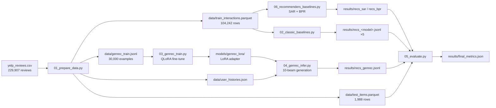

# Architecture

How the pipeline works, stage by stage: the data flow, the exact algorithms behind each script, and the full fine-tuning recipe.

## Pipeline overview

Five independent scripts form a linear pipeline. Each stage reads only files written by earlier stages, so any stage can be re-run in isolation.



Three model families consume the **same training interactions** and are scored on the **same held-out items**:

- the five classic recommenders (Stage 2) operate on the `(user, item, rating)` matrix;
- SAR and BPR (Stage 6, from the recommenders-team library) operate on the same interactions with ranking objectives;
- GenRec operates on the *textual sequence of business names*, per the paper (arXiv 2307.00457): recommendation as conditional text generation.

---

## Stage 1 — Data preparation (`01_prepare_data.py`)

**Input:** `yelp_reviews.csv`, columns `user_id, business_id, business_name, stars, date`.

**Cohort.** Users with ≥ 20 reviews (`MIN_REVIEWS = 20`) → 1,988 users, 106,230 interactions over 10,230 businesses. This keeps every test user with a meaningful history while staying small enough for a ~2-hour end-to-end run; the constant is the single knob for scaling up (≥ 10 gives 4,393 users / 138k interactions).

**Name handling.** Two normalizations with different jobs:

- *Display form* (used in prompts): raw name with whitespace collapsed — `"Joe's  Real BBQ" → "Joe's Real BBQ"`. Casing is preserved because the LLM learns to generate it.
- *Match form* (`norm_name`, used everywhere hits are decided): display form lowercased. All eight models are scored in this space.

**Chronological ordering.** A single stable sort by `date` over the whole frame (`sort_values(kind="stable")`). Yelp dates have day granularity, so same-day reviews by one user keep their original CSV order — deterministic across runs.

**Leave-one-out split** (the paper's protocol). `groupby(user).tail(1)` after the sort selects each user's chronologically last review → `test_items` (1,988 rows). Everything else → `train_interactions` (104,242 rows). An assertion checks the two partitions sum to the input exactly.

**GenRec training examples.** For each user's *training* sequence `s₁ … sₙ` (test item excluded by construction), a sliding window emits one example per position `i ≥ MIN_CONTEXT (3)`:

- input: the up-to-15 names before position `i` (`MAX_HISTORY = 15`, bounds the prompt to ~320 tokens),
- output: the name at position `i`.

This yields 98,278 candidate examples; a seeded `random.sample` keeps 30,000 (`N_TRAIN_EXAMPLES`). Each JSONL row carries `instruction / input / output`:

```json
{"instruction": "Given a list of restaurants the user has visited in chronological order, predict the restaurant the user will visit next.",
 "input": "Restaurants visited: Four Peaks Brewing Co, Heart Attack Grill, ...",
 "output": "Joe's Real BBQ"}
```

A leakage assertion verifies no example's target equals the user's held-out test name unless that name also legitimately occurs inside the training sequence (chains can repeat).

---

## Stage 2 — Classic baselines (`02_classic_baselines.py`)

All five models train on `train_interactions` only, expressed as a dense matrix pair:

- `R` — ratings, `float32`, shape `1988 × 10165` (items that appear in training),
- `B = (R > 0)` — the observation mask,
- `μ` — global mean rating (the fallback prediction).

Dense is deliberate: at this scale `R` is 81 MB and every similarity computation becomes one or two BLAS matmuls.

### Similarities (surprise semantics, vectorized)

`scikit-surprise` computes similarities **over co-rated entries only**, which differs from naive matrix cosine. Both are reproduced exactly with mask algebra — zero entries contribute nothing to the numerators, and the masks restrict the norms:

- **Cosine** (user-user): `num = R·Rᵀ`; `d₁ = (R∘R)·Bᵀ` gives, for each pair `(a,b)`, `Σ r_a²` *over items b also rated*. Then `sim = num / √d₁ ∘ √d₁ᵀ`.
- **MSD** (item-item): with `S = R·Rᵀ`, `Q = (R∘R)·Bᵀ`, `C = B·Bᵀ` (co-rating counts), the summed squared difference is `D = Q + Qᵀ − 2S` and surprise's `sim = 1/(msd+1)` becomes `C/(D+C)`.

### KNNBasic prediction, full catalog

surprise predicts `r̂(u,i) = Σ_{v∈topk} sim·r / Σ_{v∈topk} sim` over the k most similar neighbors *who rated i*, falling back to `μ` when fewer than `min_k` positive-similarity neighbors exist. Naively that is a per-`(u,i)` top-k over 20M pairs. Two observations make it fast:

1. **All ratings are positive, so all sims are ≥ 0** — "top-k by similarity, then keep sim > 0" equals surprise's `nlargest(k)` + positive-sim accumulation.
2. **Most items have fewer raters than k** (mean ≈ 10 raters vs k = 40), so for them "top-k neighbors" = *all* raters, and the whole prediction matrix collapses to three matmuls: `num = Sim·R`, `den = Sim·B`, `cnt = (Sim>0)·B`.

Only the exceptions get corrected: the 562 items with > 40 raters (user-user) and the 1,138 users with > 30 rated items (item-item) are re-computed with an `argpartition`-based exact top-k over just their rater/rated slices. Predictions with `cnt < min_k` or zero denominator become `μ`. Hyperparameters are the tuned values: user-user cosine k=40/min_k=6, item-item msd k=30/min_k=9.

### FunkSVD

Plain SGD on `r̂ = μ + b_u + b_i + q_i·p_u`, 100 factors, `N(0, 0.1)` init with a fixed seed, and tuned `n_epochs=20, lr=0.01, reg=0.2`. The update uses pre-update copies of `p_u, q_i` (matching surprise's implementation ordering).

### From scores to recommendations

For every model: mask already-rated items to `−∞`, stable-argsort each user's row, walk down the ranking mapping `business_id → norm_name`, dedupe names keeping the best rank, stop at 10. Rank-based and popularity are the same machinery with a broadcast global score row (average rating with ≥ 50 interactions; rating count).

### Why trust a reimplementation

Two independent validations, both in the repo:

1. **Cross-implementation check** — the vectorized full-matrix KNN was compared against a separately written per-pair predictor on 500 random unseen pairs: max abs difference 1e-6.
2. **Rating-protocol sanity run** — the same code, run under a classic rating-prediction protocol (≥ 100-review cohort, seeded random 80/20 rating split, clipped predictions, precision/recall@10 at threshold 3.5), lands in the expected range for these algorithms on this data: RMSE 0.93–0.99, F1@10 0.50–0.57 (`results/sanity_check_rating_protocol.json`).

---

## Stage 3 — Fine-tuning (`03_genrec_train.py`)

The paper fine-tunes LLaMA-7B with LoRA on instruction-formatted sequences (lr 3e-4, max length 256, batch 128, AdamW, 4×A5000). This implementation adapts that recipe to consumer-GPU scale, parametrized via `--base / --epochs / --out`:

- **v1 (quick):** Llama-3.2-1B, 30k sampled windows, 2 epochs — 21 min, final loss ≈ 1.60.
- **v2 (scaled, current default):** Llama-3.2-3B, all 98,278 windows, 3 epochs (18,429 steps) — 4.3 h at 1.16 it/s, final loss ≈ 1.40.

The description below applies to both; numbers cite the v1 run where they differ only by scale.

### Model loading

```python
FastLanguageModel.from_pretrained("unsloth/Llama-3.2-1B-Instruct",
                                  max_seq_length=320, load_in_4bit=True)
```

unsloth resolves this to the pre-quantized `llama-3.2-1b-instruct-unsloth-bnb-4bit` checkpoint (NF4 weights, bf16 compute). `max_seq_length=320` covers the longest prompt (15 names ≈ 200–280 tokens with the chat template) with headroom.

### LoRA configuration

| Setting | Value | Note |
|---|---|---|
| Rank r | 16 | α = 32 (scale 2.0), dropout 0 |
| Target modules | `q,k,v,o,gate,up,down_proj` | all attention + MLP projections, every layer |
| Trainable params | 11,272,192 | 0.90% of 1.25B |
| Gradient checkpointing | `"unsloth"` | activation offload variant |
| Seed | 42 | |

The frozen base stays in 4-bit; only the LoRA matrices train in higher precision — QLoRA. Peak VRAM stays far under the card's 16 GB.

### Example formatting

Each JSONL row becomes a three-turn Llama-3.2 chat:

```
<|begin_of_text|><|start_header_id|>system<|end_header_id|>
You are a restaurant recommendation system.<|eot_id|><|start_header_id|>user<|end_header_id|>
Given a list of restaurants ... Restaurants visited: A, B, C, ...<|eot_id|><|start_header_id|>assistant<|end_header_id|>
Joe's Real BBQ<|eot_id|>
```

A fixed system prompt is supplied so the template is byte-identical between training and inference. (unsloth detects and removes the double BOS that `apply_chat_template` + the trainer's tokenization would otherwise produce.)

### Loss masking — the crucial detail

`train_on_responses_only(trainer, instruction_part="<|start_header_id|>user<|end_header_id|>\n\n", response_part="<|start_header_id|>assistant<|end_header_id|>\n\n")` sets `labels = -100` on everything except the assistant span. The script asserts this on a sample; the surviving tokens decode to exactly:

```
"Joe's Real BBQ<|eot_id|>"
```

So the model is optimized *only* on generating the next restaurant's name and stopping — the paper's "output" target — not on reproducing the prompt.

### Optimization

| Setting | Value | Rationale |
|---|---|---|
| Learning rate | 3e-4, linear decay | the paper's peak LR |
| Warmup | 100 steps | scaled-down version of the paper's 1,000 (we take ~4k steps, they took far more) |
| Batch | 8 per device × 2 grad-accum = 16 | fits comfortably; 30k examples → 1,875 steps/epoch |
| Epochs | 2 (3,750 steps) | initial-metrics budget; paper used 5 |
| Optimizer | `adamw_8bit`, weight decay 0.01 | |
| Precision | bf16 compute over NF4 weights | |
| Packing | off; unsloth auto-enables padding-free batching | same effect as packing without cross-example attention |

### Training dynamics

Loss (on target names only) falls 4.45 → ~1.9 across epoch 1, drops sharply at the epoch boundary (1.88 → 1.72, the model re-seeing examples), and settles ≈ 1.60. Runtime: **1,284 s (21.4 min), 46.7 examples/s** on the RTX 5070 Ti. The full curve is plotted in `results/report.html`.

Post-training, the script saves the adapter (`models/genrec_lora/` — adapter weights + tokenizer, ~60 MB) and runs a 5-prompt greedy smoke test to confirm the model emits plausible catalog names.

---

## Stage 4 — Inference (`04_genrec_infer.py`)

**Why plain `transformers` + `peft` here, not unsloth:** unsloth's patched fast-generate returns the KV cache as a raw tuple; transformers 5.x beam search calls `past_key_values.reorder_cache(beam_idx)` when it permutes beams, and crashes (`AttributeError: 'tuple' object has no attribute 'reorder_cache'`). Loading the same 4-bit base with vanilla `AutoModelForCausalLM` and attaching the adapter with `PeftModel.from_pretrained` restores standard cache objects, and beam search works. Fine-tuning still gets unsloth's speed; only generation goes through the stock path.

**Prompt.** Identical system + instruction template, user's last ≤ 15 training-history names, `add_generation_prompt=True` so the text ends at the assistant header.

**Generation.** Users are batched with **left padding** (decoder-only requirement), then beam search via `model.generate(num_beams=N, num_return_sequences=N, do_sample=False, early_stopping=True, max_new_tokens=24)`. The output's prompt prefix is sliced off (valid because left padding aligns all prompts to the same length) and the N continuations per user are decoded.

**Constrained decoding (v2 default).** A token trie is built over all 7,218 catalog display names (each name tokenized once with `add_special_tokens=False`; terminal nodes admit `<|eot_id|>`). A `prefix_allowed_tokens_fn` walks the trie along the tokens generated so far and returns the legal continuations — every beam is thereby forced to spell a real business name and stop. `--exclude-seen` builds per-user tries omitting the user's visited names (~10 ms each from the pre-tokenized cache); measured effect: none — the model wasn't spending beams on revisits. `--unconstrained` restores v1's free-form decoding.

**Post-processing per user** — the generative analog of the classics' seen-item masking:

1. normalize each beam string (`norm_name`),
2. dedupe preserving beam order (beam order ≈ model confidence → list rank),
3. drop names already in the user's history (`recs`); the unfiltered list is kept as `recs_raw` for diagnostics.

Throughput: ~8.7 users/s, **3.8 min** for 1,988 users. Diagnostics computed at the end: 97.7% of raw generations exist in the catalog; 10.9% were already-visited and got filtered; deduped lists average 8.9 names.

---

## Stage 6 — recommenders-team baselines (`06_recommenders_baselines.py`)

Two ranking-optimized algorithms from the [recommenders-team library](https://github.com/recommenders-team/recommenders), run through the actual library rather than reimplemented. It supports Python ≤ 3.11 and (as of 1.2.1) NumPy < 2, so this stage runs in its own venv (`.venv-rec`, CPython 3.11 + `recommenders` + `numpy==1.26.4`) — the pipeline's file-based handoff makes mixing interpreters trivial.

- **SAR** (`recommenders.models.sar.SAR`): user affinity = time-decayed sum of ratings (30-day half-life on review timestamps); item similarity = Jaccard over co-occurrence; score = affinity × similarity. Top-30 via `recommend_k_items(remove_seen=True)`, then the shared name-dedupe → top-10. One duplicate (user, item) rating is collapsed keeping the most recent — matching the dense-matrix baselines' last-write-wins behavior.
- **BPR** (via Cornac, the backend the recommenders library wraps): implicit-feedback MF trained with a pairwise ranking loss — k=100 factors, 200 iterations, lr 0.01, reg 0.001, seed 42. Scores for all items come from the learned factors (`U·Vᵀ + b_i`) mapped back to this pipeline's index order, seen items masked.

Both emit `results/recs_{sar,bpr}.jsonl` in the shared format and flow through Stage 5 unchanged. They are the strongest baselines in the final table — evidence that *ranking-objective* models are the right classical comparison for top-N, not rating predictors.

## Stage 5 — Evaluation (`05_evaluate.py`)

**Matching space.** All hits are decided at normalized-name level. 898 names map to multiple `business_id`s (chains); GenRec can only emit names, so classics' id-ranked lists are mapped to names and deduped — every model is scored in the identical space. Ground truth = the held-out review's normalized name.

**Metrics** (single relevant item per user):

- `HR@k` — fraction of users whose target appears in their top-k,
- `NDCG@k` — `1/log₂(rank+1)` if the target is at `rank ≤ k`, else 0; averaged over users,
- `Precision@k` / `Recall@k` / `F1@k` — computed per user with the fixed denominator k. With one relevant item these collapse to `Recall@k = HR@k` and `Precision@k = HR@k / k`; they are reported so the table speaks the same language as classic rating-split evaluations, but HR/NDCG carry the signal.

**Fairness properties worth knowing:**

| Property | Classics | GenRec |
|---|---|---|
| Candidate space | 10,165 training items, ranked exhaustively | open vocabulary (anything it can spell) |
| Seen-item handling | ids masked to −∞ | seen *names* filtered post-hoc |
| List length | always 10 | 8.9 avg (beam dedupe) — a handicap at @10 |
| Cold targets (2.8% of tests) | unreachable | reachable in principle, never observed |

---

## Design decisions

- **Names, not IDs** — the paper's core idea; it is what lets the model generalize ("Yogurtland, Yogurtology → Yogurtini") and what makes name-level scoring the right common denominator.
- **Leave-one-out rather than a random 80/20 rating split** — random splits leak future interactions into training and can't express "next item"; the rating-prediction protocol survives only as the sanity check for the numpy implementations.
- **Numpy implementations rather than `scikit-surprise`** — surprise is source-only on PyPI and the machine has no C compiler; the implementations are validated to 1e-6 against an independent per-pair predictor and sanity-checked under the rating-prediction protocol.
- **Determinism** — every stochastic step is seeded (cohort sampling, SVD init, LoRA init, trainer). Exact loss values still vary slightly across GPUs/driver versions (non-deterministic CUDA kernels); rankings and metrics reproduce to reporting precision.

## Extension points

Each knob is a top-of-file constant:

| Change | Where | Status / effect |
|---|---|---|
| More training signal | `N_TRAIN_EXAMPLES` in `01` | **done in v2** (all 98,278): +26% HR@10, −11% HR@5 |
| Constrained decoding, 20 beams | `04` (`--beams`, trie on by default) | **done in v2**: +24% HR@10, 100% in-catalog |
| Seen-excluded per-user tries | `04 --exclude-seen` | **done (v3)**: no effect |
| Bigger cohort | `MIN_REVIEWS` in `01` (20 → 10) | untried: 4,393 users / 138k interactions |
| Lower LR + early stopping | `03` | untried: likely fix for the v2 top-5 regression |
| Hybrid: BPR candidates + LLM rerank | new script | untried: combines the two winners |
